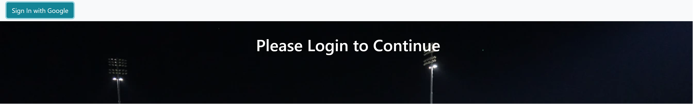
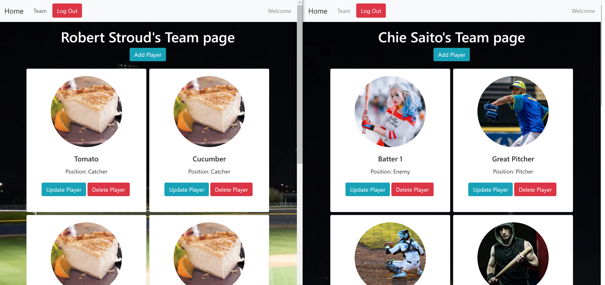

# Sports Roster

Sports Roster lets you pick your favorite sports team. Add any person/animal to your team and you can make the best team of yours!
You are the only one who can see your team (unless you give someone else your email address and password) so build your own great team and enjoy! 

[](https://app.netlify.com/sites/compassionate-curran-e86617/deploys)

Deployed site:
https://cs-sports-roster.netlify.app/


## Screenshot

Page Load - Sign in with Google Button
***


User views after logged in
***


## Technologies used
HTML / SCSS / JavaScript / React / Reactstrap

## Loom Video
https://www.loom.com/share/031e95e4082244d4ba7aa6de5bfef70a

## Code Snippet
```
export default function Team({ user, player, setPlayer }) {
  const [showButton, setShowButton] = useState(false);
  const handleClick = () => {
    setShowButton((prevState) => !prevState);
  };

  return (
    <main>
      <section className="header">
      <header className="h1">{user.fullName}&apos;s Team page</header>
      { !showButton
        ? <Button color='info' onClick={handleClick}>Add Player</Button>
        : <div>
        <Button color='info' onClick={handleClick}>Are you done yet?</Button>
          <TeamForm setPlayer={setPlayer} user={user}/>
        </div>
        }
      </section>
      <section className="container">
        <div className='playerContainer'>
        {player.map((playerInfo) => (
          <PlayerCard key={playerInfo.firebaseKey}
            firebaseKey={playerInfo.firebaseKey}
            name={playerInfo.name}
            position={playerInfo.position}
            uid={playerInfo.uid}
            imageUrl={playerInfo.imageUrl}
            setPlayer={setPlayer}
            user={user}
          />
        ))}
        </div>
      </section>
    </main>
  );
}
```
